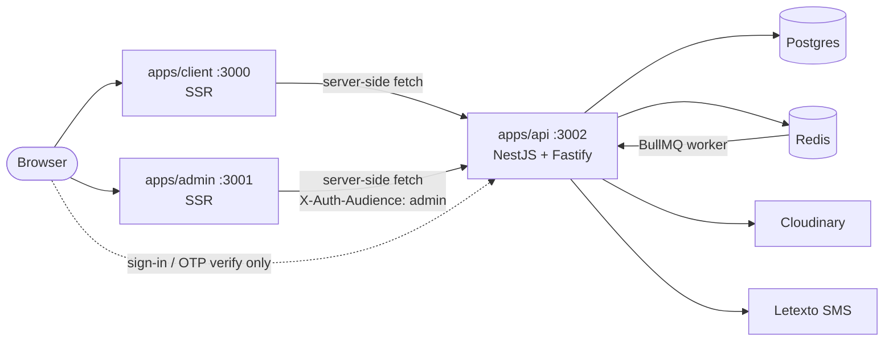

# Overview

RetrouveCI is a lost-and-found platform for Côte d'Ivoire. Two things happen on
it:

1. someone **publishes a listing** for an object they lost or found, and the
   platform looks for the matching listing on the other side;
2. someone **buys QR-code stickers**, sticks them on their belongings, and a
   finder who scans one reaches a contact form without learning who the owner
   is.

The second one is **built and on stand-by**: the API serves it, the backoffice
manages it, and six public routes are commented out of `apps/client`'s
`routes.ts` pending the MVP launch. See
[Business flows](04-business-flows.md#3-sticker-orders).

The UI is entirely in French. Identifiers, database columns, commit messages and
this documentation are English.

## Deployables

Three images, one database, one Redis.

| Deployable                         | Port (dev) | Stack                | Serves                                |
| ---------------------------------- | ---------- | -------------------- | ------------------------------------- |
| [`apps/client`](../../apps/client) | 3000       | React Router v7, SSR | The public app                        |
| [`apps/admin`](../../apps/admin)   | 3001       | React Router v7, SSR | The backoffice                        |
| [`apps/api`](../../apps/api)       | 3002       | NestJS on Fastify    | REST API + both better-auth instances |

Postgres and Redis come from [`docker-compose.yml`](../../docker-compose.yml) in
development.



Two things in that diagram are worth stating out loud.

**The browser almost never talks to the API.** Both front-ends fetch server-side
from their loaders and actions. The three exceptions are the calls whose
`Set-Cookie` the browser must receive directly — phone sign-in, OTP
verification, and the backoffice's password change — because this repository has
no mechanism for forwarding `Set-Cookie` from an API response back through a
React Router action.

**The worker is the API.** BullMQ consumers live in the same process as the HTTP
server ([`presentations/*/queue-consumers/`](../../apps/api/src/presentations)).
There is no separate worker deployable, so a queue with no reachable Redis fails
silently — which is why `REDIS_URL` is refused as absent in production.

## Repository map

```text
apps/
  client/    Public app (React Router v7 / Vite, SSR)
  admin/     Backoffice (React Router v7 / Vite, SSR)
  api/       REST API (NestJS / Fastify) + BullMQ consumers
packages/
  auth/                Shared better-auth core, framework-agnostic
  contracts/           Zod schemas shared by the API and both fronts
  database/            Prisma schema, migrations, generated client
  ui/                  Shared shadcn/ui component library (source-only)
  web-kit/             Front code shared client <-> admin (source-only)
  eslint-config/       Shared ESLint configs
  typescript-config/   Shared tsconfig presets
  vitest-config/       Shared Vitest presets
docs/                  This directory
```

Three of the eight packages have a **build step** and are resolved through their
`dist` by at least one consumer: `database`, `auth` and `contracts`. `ui` and
`web-kit` are source-only, so each app's Vite compiles them directly. See
[Shared packages](03-shared-packages.md).

## Which deployable owns what

A question that comes up constantly, because three of the answers are
counter-intuitive.

| Behaviour                                | Owner                                                                                 | Note                                                                       |
| ---------------------------------------- | ------------------------------------------------------------------------------------- | -------------------------------------------------------------------------- |
| Validation of any request body           | [`packages/contracts`](../../packages/contracts)                                      | One schema, applied by the API's pipe **and** by the front's action        |
| Password rule                            | [`packages/auth`](../../packages/auth) + contracts                                    | better-auth enforces the length; the contract owns the complexity          |
| Deciding which session a request carries | `apps/api` — [`SessionGuard`](../../apps/api/src/shared/auth/guards/session.guard.ts) | Two cookies are not isolation on their own                                 |
| Users and administrator accounts         | better-auth's `admin()` plugin                                                        | **No API domain of its own** — the backoffice calls the plugin's endpoints |
| Match scoring                            | `apps/api` — [`domains/matching`](../../apps/api/src/domains/matching)                | Runs on a queue, never in a request                                        |
| Photo storage                            | Cloudinary, via `apps/api`                                                            | The front uploads to the API, never to Cloudinary                          |
| Category and status labels               | Each front                                                                            | The **values** come from the contract; only the French copy is local       |

## Two sessions, one API

The API runs **two** better-auth instances over the same database. This is the
single most surprising thing about the system, so it is spelled out here and
again in [Applications](02-applications.md#authentication).

| Instance | Base path         | Cookie                           | Extra plugin    |
| -------- | ----------------- | -------------------------------- | --------------- |
| public   | `/api/auth`       | `better-auth.session_token`      | `phoneNumber()` |
| admin    | `/api/admin-auth` | `retrouveci-admin.session_token` | —               |

One browser can therefore hold both sessions at once. An administrator is also
an ordinary user, and signing in to one app no longer replaces the other's
session.

> ⚠️ **`/api` is the only prefixed path.** Domain endpoints are `/lost-items`,
> `/qr-codes`, `/stats` — there is no global prefix. `/api` belongs to the two
> better-auth instances alone.

## Where to go next

- adding an endpoint, a route or a form → [Applications](02-applications.md)
- about to write a schema or a type twice →
  [Shared packages](03-shared-packages.md)
- following a listing, a sticker or a sign-in →
  [Business flows](04-business-flows.md)
- deploying or debugging production → [Operations](05-operations.md)
