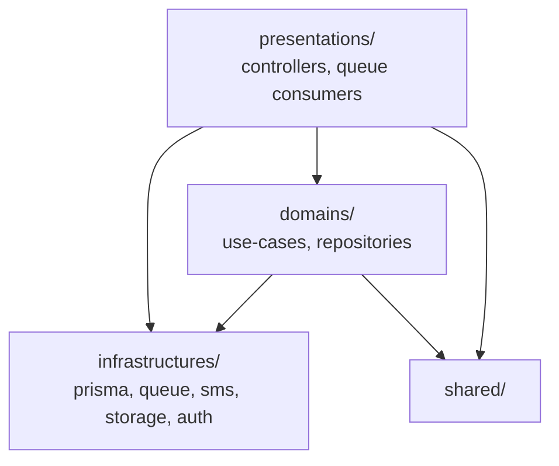
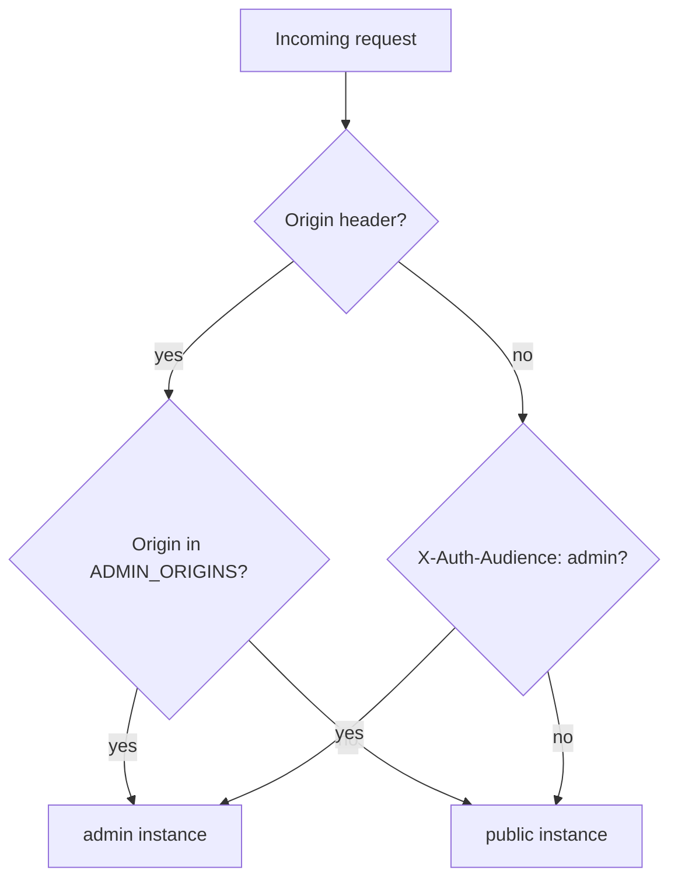
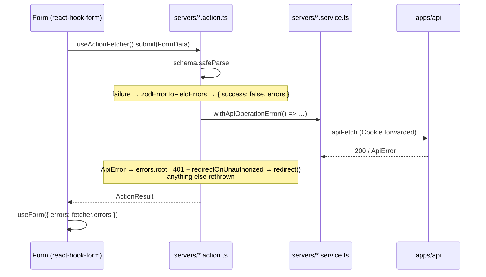

# Applications

How each of the three deployables is organised, and the rules that keep them
that way.

## `apps/api` — NestJS on Fastify

Domain-Driven / Clean Architecture. `src/` holds **exactly four** folders.

```text
src/
  domains/          Business core — one folder per bounded context
  presentations/    HTTP layer: controllers + queue consumers
  infrastructures/  Framework and IO wiring
  shared/           Cross-cutting: errors, filters, pipes, guards, swagger, utils
  app.module.ts
  main.ts
```

### The dependency rule



- **`domains/` knows nothing about HTTP.** No `@Body`, no `Request`, no status
  code. It raises domain errors and
  [`DomainExceptionFilter`](../../apps/api/src/shared/filters/domain-exception.filter.ts)
  translates them.
- **Authorization lives in `presentations/`**, never in a use-case or a
  repository. `@Roles([...])`, `@AllowAnonymous()`, `@OptionalAuth()`.
- **A use-case never calls another use-case** _inside its own domain_. Shared
  checks go to `helpers/require-<entity>.ts`. **Across** domains the rule
  reverses: a domain reaches another domain's use-case, never its repository —
  `matching` writes through `CreateNotificationUseCase`, and `qr-codes` writes
  through `CreateContactMessageUseCase`.

### Shape of a domain

Every domain looks like this. `contact-messages` is the reference.

```text
domains/<domain>/
  use-cases/            One file per use-case, one public `execute`
    __tests__/
  repository/<entity>.repository.ts   One concrete class, injected by type
  helpers/require-<entity>.ts         Checks two or more use-cases share
  mappers/  errors/  types/  constants.ts
  <domain>-domain.module.ts           Provides and exports the above
```

Three deliberate absences:

- **no interface + `Symbol` token for the repository.** The file in
  `repository/` _is_ the repository.
- **no `models/` folder.** Entity types live in `types/`; a paginated response
  is `Paginated<T>` from
  [`shared/utils/pagination.util.ts`](../../apps/api/src/shared/utils/pagination.util.ts).
- **no `*.dto.ts` and no `class-validator`.** See below.

The eight domains: `contact-messages`, `events`, `lost-items`, `matching`,
`notifications`, `qr-codes`, `reporting`, `sticker-orders`. `matching` has no
repository of its own — it reads `lost-items` and writes through
`notifications`.

`presentations/` additionally holds `auth`, `health`, `stats` and `uploads`,
which are presentation features with no domain: `stats` delegates to
`reporting`, `uploads` to `infrastructures/storage`.

### Validation

Every `@Body` and `@Query` carries its own
[`ZodValidationPipe`](../../apps/api/src/shared/pipes/zod-validation.pipe.ts)
over a schema from `@app/contracts/<domain>`. There is no global
`ValidationPipe`.

```ts
@Post()
@ApiZodBody(createLostItemSchema)
create(
  @Body(new ZodValidationPipe(createLostItemSchema)) data: CreateLostItemData,
) { … }
```

Four consequences worth knowing:

- the pipe **transforms** as well as validates, so a `.trim()` or a
  normalisation written in the contract reaches the use-case;
- a body field the schema does not know is **stripped**, where the old
  `forbidNonWhitelisted` answered 400;
- the failure shape is
  `400 { message: 'Validation failed', errors: { <field>: [...] } }`;
- messages are French. The pipe passes `z.locales.fr().localeError` as a
  **per-call** error map, so a field whose schema names no message still answers
  in French — and better-auth, which shares the zod instance, is untouched. A
  message the schema _does_ name always wins.

Swagger is derived from the same schema:
[`@ApiZodBody` / `@ApiZodQuery`](../../apps/api/src/shared/swagger/api-zod.decorator.ts)
run Zod 4's `z.toJSONSchema`, so `/docs` cannot drift from what the pipe
enforces.

### Authentication

[`SessionGuard`](../../apps/api/src/shared/auth/guards/session.guard.ts) is the
app's global guard and replaces the one `@thallesp/nestjs-better-auth` would
register (both registrations pass `disableGlobalAuthGuard: true`).

It decides **which of the two instances** to read:



`Origin` wins whenever present: a browser sets it, and a page can neither forge
nor remove it, so an injected script cannot claim the other audience. The header
answers server-side calls only, which carry no `Origin` — `apps/admin`'s
`apiFetch` sends it on every call. **The chosen instance is the only one
consulted; there is no fallback**, which is the whole point.

The guard honours `@AllowAnonymous()`, `@OptionalAuth()` and `@Roles([...])`,
and attaches `request.session` / `request.user` so `@Session()` keeps working.

> ⚠️ **Every backoffice call goes to `/api/admin-auth`.** Because the shared
> core carries the `admin()` plugin, _both_ instances expose `/admin/list-users`
> and friends — so a call to the wrong base path does not 404, it validates
> against the other app's cookie and answers **401**. These routes are
> middleware mounted before Nest, so `SessionGuard` never catches the mistake.

### Background jobs

Two BullMQ queues, one shared Redis connection built by
[`queue.config.ts`](../../apps/api/src/infrastructures/queue/queue.config.ts).

| Queue      | Producer                                        | Consumer           | Options                                                                        |
| ---------- | ----------------------------------------------- | ------------------ | ------------------------------------------------------------------------------ |
| `otp`      | `OtpDispatcher` (better-auth's `sendOTP`)       | `OtpConsumer`      | 3 attempts, exponential backoff, **removed on success and on failure**         |
| `matching` | `MatchingDispatcher` (moderation → `published`) | `MatchingConsumer` | 3 attempts, exponential backoff, last 100 completed kept, failures kept a week |

The eviction rules differ on purpose. An OTP job carries a live code and must
leave no trace; a matching job carries an id, and that history is what makes a
missing notification diagnosable.

Both consumers convert a permanently-doomed job into BullMQ's
`UnrecoverableError` rather than burning the retries a transient failure needs:
`OtpConsumer` on an `InvalidRecipientError`, `MatchingConsumer` on a
`NotFoundError`.

### Tests

Vitest, `*.spec.ts`, in a `__tests__/` folder mirroring the code. Shared data
builders go in a `*.fixture.ts`, which `tsconfig.build.json` excludes alongside
the specs.

```bash
pnpm --filter @app/api test
```

## `apps/client` and `apps/admin` — React Router v7

Same stack: React Router v7 (Vite, SSR), React 19, Tailwind CSS v4 configured
through CSS `@theme` (no JS config), shadcn/ui via `@app/ui/components`, forms
on react-hook-form + Zod.

### Layout

```text
app/routes/<area>/<page>/
  _index.tsx        The page. Thin: page-level state only
  servers/          *.loader.ts, *.action.ts, *.service.ts
  components/       Section components owned by this page
  hooks/  helpers/  mappers/  types/  *.schema.ts
app/components/     Components used across routes
app/context/        auth.tsx, theme.tsx
app/shared/         constants/, helpers/, hooks/, mappers/, types/, utils/
```

An **area** folder may hold the `components/`, `servers/` and `types/` its
sub-routes share — see `routes/publish/` and `routes/auth/`.

> ⚠️ `routes.ts` resolves route modules **by path**. Moving a page is caught by
> `pnpm build`, never by `typecheck` alone.

### The one rule that matters

**A component never calls `apiFetch` or `authClient`.** All API access goes
through a feature's `servers/*.loader.ts` or `servers/*.action.ts`. Three
sanctioned exceptions:

1. a `helpers/*.client.ts` wrapper, for the calls whose `Set-Cookie` the browser
   must receive itself;
2. a **resource route** — `routes.ts` pointing a path straight at a
   `servers/*.loader.ts` with no component — when the data is wanted lazily
   rather than per navigation (`publish/matches`, `account/activity`);
3. `shared/helpers/session.server.ts`, the server-side session gate every loader
   goes through.

### The action contract

Every action answers `ActionResult` from
[`@app/web-kit/action`](../../packages/web-kit/src/action): `{ success: true }`
or `{ success: false, errors? }`, where `errors` is already shaped as
react-hook-form `FieldErrors` — one entry per field, plus `root` for anything
belonging to no field.



Three helpers do the work, all in `@app/web-kit/action`:

| Helper                                           | Job                                                                                            |
| ------------------------------------------------ | ---------------------------------------------------------------------------------------------- |
| `zodErrorToFieldErrors`                          | a failed `safeParse` → the `FieldErrors` map                                                   |
| `withApiOperationError` / `withApiOperationData` | wraps the API call; `ApiError` → `root`, 401 → `redirect()` when asked, anything else rethrown |
| `useActionFetcher`                               | `{ data, isOk, errors, isSubmitting, submit, Form, state }`                                    |

Render `root` with `FormRootError`. Put success side effects in a `useEffect`
guarded on `fetcher.isOk` — plus a `hasSubmitted` flag whenever the effect must
not be replayed, since `isOk` stays true afterwards.

`useActionFetcher` takes an optional key, but it is **not** needed to keep two
forms apart: `useFetcher` falls back to `useId()`. Pass a key only to share one
fetcher's state between components, or to keep it alive across an unmount.

### Forms

`useForm` with `standardSchemaResolver(schema)` from
`@hookform/resolvers/standard-schema`, plus `Controller` — or `useController`
when one component takes several fields as a flat prop contract.
`FormInputField` / `FormTextareaField` from `@app/ui/components/form` wrap the
common single-input case; a form whose markup is bespoke inlines `Controller`
instead, so migrating it leaves the DOM untouched.

No hand-rolled `useState` validation anywhere, in either app or in
`packages/ui`.

### Tests

Both apps declare two Vitest **projects**:

| Project | Files               | Environment                                        |
| ------- | ------------------- | -------------------------------------------------- |
| `node`  | `app/**/*.test.ts`  | node — helpers, mappers, schemas, loaders, actions |
| `ui`    | `app/**/*.test.tsx` | real Chromium, Vitest browser mode                 |

Components and hooks mount through `createRoutesStub` and are driven with `page`
/ `userEvent`, all imported from `app/shared/helpers/testing.ts` — no test
imports the runner's packages directly. A real browser is what removes the jsdom
shims Radix and native form submission would otherwise need.

Two traps the config works around: the `reactRouter()` Vite plugin is **disabled
under Vitest** (it owns the route-module graph and an SSR entry the browser
runner cannot mount), and `optimizeDeps.entries` points at the test files so
Vite pre-bundles up front instead of discovering the `@app/ui/components`
barrel's Radix packages mid-run.

```bash
pnpm --filter @app/admin test        # both projects
pnpm --filter @app/admin test:ui     # browser mode only
```

### Differences between the two fronts

|                | `apps/client`                               | `apps/admin`                                    |
| -------------- | ------------------------------------------- | ----------------------------------------------- |
| Sign-in        | phone number + OTP (`phoneNumberClient`)    | email + password (`adminClient`)                |
| Session gate   | `getServerSession` / `requireServerSession` | `requireAdminSession`, plus `role === 'admin'`  |
| Auth base path | `/api/auth`                                 | `/api/admin-auth`                               |
| `apiFetch`     | no audience header                          | `X-Auth-Audience: admin` on every call          |
| Page title     | per route                                   | `handle.title`, read by the top bar and the tab |

Both keep their own `auth-client.ts`, `session.server.ts`, `redirect.ts` and
`page-meta.ts`: same idea, genuinely different code. What they _do_ share lives
in [`@app/web-kit`](03-shared-packages.md#appweb-kit).
