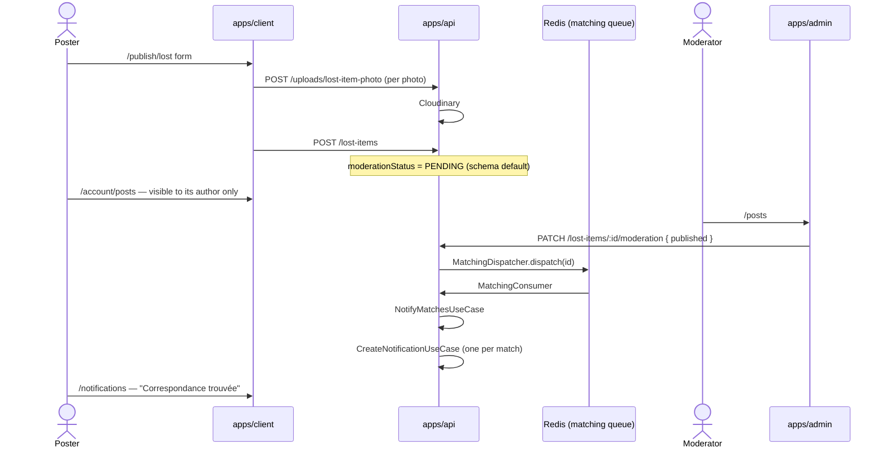
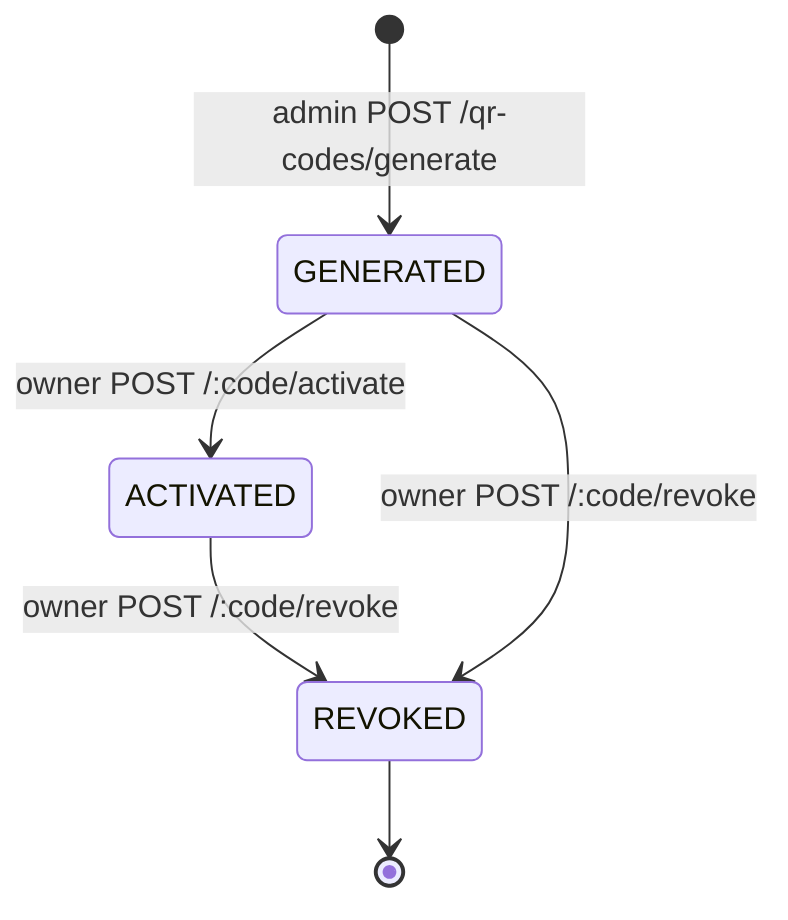
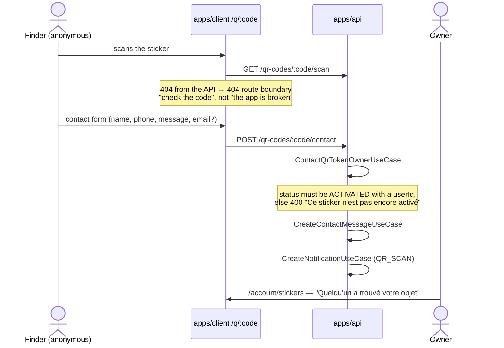
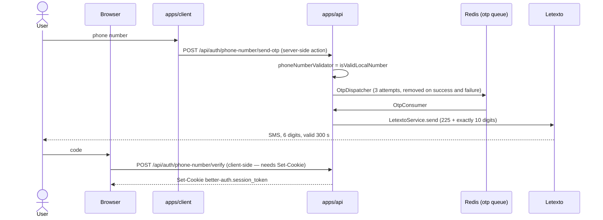

# Business flows

Four flows, followed end to end. Each one crosses at least two deployables, and
each has at least one step that is not where you would expect it.

## 1. A listing, from publication to match

### Statuses

A listing carries **two** independent statuses. Conflating them is the usual
mistake.

|                    | Values                             | Set by                         |
| ------------------ | ---------------------------------- | ------------------------------ |
| `moderationStatus` | `PENDING` → `PUBLISHED` / `HIDDEN` | A moderator, in the backoffice |
| `resolutionStatus` | `ACTIVE` → `RESOLVED` / `EXPIRED`  | The poster, or expiry          |

`PENDING` is the schema default; neither `create` nor the contract sets it.

### Reading one listing

`GET /lost-items/:id` is `@OptionalAuth()` and runs `ViewLostItemUseCase`:
**published for everyone, unpublished for its author alone**, 404 otherwise. The
view counter is incremented only for a visitor who is not the author.

The strict 404 for an author's own pending listing was rejected on purpose:
`/account/posts` renders a "Voir" link for every status, so the author would
have lost the preview of their own listing.

> ⚠️ This route used to be wired to a `getById` that checked no status at all,
> on an `@AllowAnonymous()` route — an anonymous caller could read a `PENDING`
> listing **with the poster's WhatsApp number**, and `views` stayed at 0 because
> the only use-case that checked publication had no caller. Fixed; the lesson it
> left is that an exported use-case with no caller is what made both bugs
> invisible.

### Matching

Runs on the `matching` queue, never in a request. Only publication makes a
listing matchable, so the enqueue sits in `updateModerationStatus`, conditioned
on `published` — not in `create`, where a listing is always `PENDING` and the
notification path was provably dead.

[`computeMatches`](../../apps/api/src/domains/matching/helpers/compute-matches.ts)
asks the repository for candidates of the **opposite** type, same category, same
`ville`, `published` and `active`, capped at `MAX_CANDIDATES` (100). Each is
scored, and anything at or above `MATCH_SCORE_THRESHOLD` (50) is a match, sorted
best first.

| Signal                                                | Points |
| ----------------------------------------------------- | ------ |
| Same category                                         | 40     |
| Same `ville`                                          | 25     |
| Same `commune`                                        | 15     |
| Event dates ≤ 7 days apart                            | 20     |
| Event dates ≤ 30 days apart                           | 10     |
| One shared word ≥ 5 characters in title + description | 10     |

Matches whose listing belongs to the source's own author are dropped, and one
notification is raised per remaining match through `CreateNotificationUseCase` —
a domain going through another domain's public API, never its repository.

`GET /lost-items/:id/matches` runs the same scoring on demand, for the poster.

## 2. A QR sticker, from batch to contact

Activation is what **assigns** the owner, so it checks the _status_, not
ownership. Every later write (`revoke`, `updateDetails`) checks ownership
through `helpers/require-owned-qr-token.ts`.

Three endpoints read a token, and the difference between them is the whole
security model:

| Endpoint                       | Access              | Returns                                      |
| ------------------------------ | ------------------- | -------------------------------------------- |
| `GET /qr-codes/:code/scan`     | `@AllowAnonymous()` | The **public view**: owner's first name only |
| `GET /qr-codes/:code`          | `@Roles(['admin'])` | The whole token, owner id included           |
| `POST /qr-codes/:code/contact` | `@AllowAnonymous()` | `{ success: true }`                          |

> ⚠️ `GET /qr-codes/:code` was `@AllowAnonymous()` and returned the whole token
> — so anyone holding a code learned the owner's `userId` and the private label,
> while `/scan` existed precisely to avoid that. **Holding a code is not a
> credential.**

The contact flow:

The finder never learns who the owner is; the owner receives the finder's
message and phone number.

The `/q/:code` page that drives this is one of the unmounted routes — see the
note under [Sticker orders](#3-sticker-orders). The API endpoints it calls are
live.

## 3. Sticker orders

`POST /sticker-orders` with a pack id, a payment method, a delivery address and
an optional coupon. The pack catalogue, the delivery fee and the free-delivery
coupons all live in `@app/contracts/sticker-orders`, so a price change lands on
both sides at once. A front adds only sales copy (`description`, `popular`,
`features`) composed onto the contract's packs.

The order form has no field for the buyer's name, their phone or the number they
paid from, so the client folds all three into `deliveryNotes` with the payment
method's **label**, not its id.

Statuses: `PENDING` → `PROCESSING` → `SHIPPED` → `DELIVERED`, or `CANCELLED`.
Only the backoffice writes them (`PATCH /sticker-orders/:id/status`).

`GET /sticker-orders/:id` answers **404** for another user's order, not 403 —
the same choice `notifications` makes, so the response confirms nothing about
whether an id exists. The error class is shared with the genuinely-missing case
on purpose, because `DomainExceptionFilter` sends `error: exception.name` and a
distinct class would have leaked through that field what the status code no
longer does.

> ⚠️ **The whole sticker feature is on stand-by in the public app.** Six route
> entries are commented out of
> [`apps/client/app/routes.ts`](../../apps/client/app/routes.ts): `stickers`,
> `stickers/order`, `account/orders`, `account/stickers`, `q/:code` and
> `download`. The **API side is live** — every endpoint described in this
> document works, and the backoffice's `/qr` and `/orders` screens are mounted —
> but no public page reaches them today. The client code is intact and its
> server layer is covered by tests; what it loses by being unmounted is `build`,
> which makes `typecheck` its only net.

## 4. Authentication

### Public app — phone number + OTP

better-auth's `phoneNumber()` plugin owns the code itself — it generates, stores
and verifies it, so there is **no parallel OTP store**. The app sets only
`expiresIn` (`OTP_TTL_SECONDS`, 300 s), the length (six, `OTP_LENGTH` in
`@app/contracts/shared`) and `phoneNumberValidator`. Without that validator a
malformed number only failed at delivery, after `OtpConsumer` had burnt its
three attempts.

Two details that look like polish and are not:

- **The recipient is normalised to `225` + exactly 10 digits**, which is what
  the gateway addresses. E.164, a bare local number, and either of them spaced
  are accepted; anything else raises `InvalidRecipientError`, which the consumer
  turns into `UnrecoverableError`.
- **The SMS templates are unaccented.** One accent switches the message from
  GSM-7 to UCS-2 and halves the segment from 160 characters to 70. Their spec
  asserts a 150-character ceiling. Templates live in
  [`shared/auth/otp-message.ts`](../../apps/api/src/shared/auth/otp-message.ts);
  the failure log names the recipient, **never** the code.

Password reset follows the same shape over `request-password-reset` and
`reset-password`, both server-side actions.

### Backoffice — email + password

`authClient.signIn.email` on `/api/admin-auth`, client-side because the browser
needs the `Set-Cookie` itself. The role check is `role === 'admin'`, and
`adminRoles: ['admin']` in `packages/auth` means a `moderator` is refused
server-side whatever the UI offers.

The **email** password-reset flow is the backoffice's alone — the public app
resets by phone OTP — so it lives there too.

> ⚠️ The reset link better-auth emails resolves a relative `redirectTo` against
> `BETTER_AUTH_URL`, which is the API's own origin, where nothing serves that
> page. `ADMIN_APP_URL` is what makes the link absolute; `appUrl()` falls back
> to the request's origin, which is right in development and behind no proxy.

### Which session a request carries

See [Applications → Authentication](02-applications.md#authentication). The
short version: **two cookies are not isolation on their own** — the browser
sends both to the API — so `SessionGuard` picks the instance from the request's
`Origin`, or from `X-Auth-Audience` when there is none.

## Notifications

Two types, both raised by the API, never by a front:

| Type          | Raised when                             | Links to            |
| ------------- | --------------------------------------- | ------------------- |
| `MATCH_FOUND` | a published listing matches yours       | `/posts/:id`        |
| `QR_SCAN`     | a finder contacts you through a sticker | `/account/stickers` |

`GET /notifications/unread-count` answers a **bare number**, not `{ count }`. A
counter the API cannot serve must read zero rather than throw — a badge must
never take the shell down.
