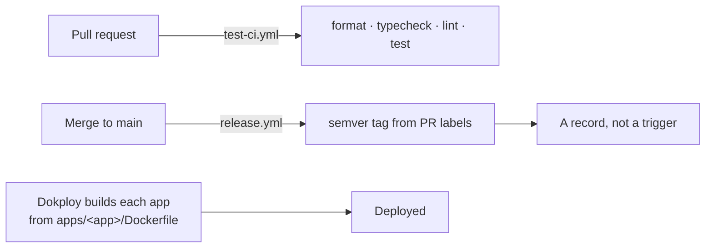

# Operations

Environments, CI/CD, images, and the failures worth recognising on sight.

## Environment variables

The rule this system follows: **a variable whose absence makes the app quietly
wrong is refused at boot, not at the first request.** Every entry marked
"required in production" below throws on startup, with a message naming the
consequence.

### `apps/api`

| Variable                                                   | Required in production                                 | Absence would mean                                                                                                                                                                 |
| ---------------------------------------------------------- | ------------------------------------------------------ | ---------------------------------------------------------------------------------------------------------------------------------------------------------------------------------- |
| `DATABASE_URL` (or `PGBOUNCER_URL`)                        | yes                                                    | —                                                                                                                                                                                  |
| `REDIS_URL`                                                | **yes**                                                | BullMQ falls back to `localhost:6379`, so the API boots perfectly healthy while every OTP and match job piles up in a queue no worker reads                                        |
| `BETTER_AUTH_SECRET`                                       | yes                                                    | —                                                                                                                                                                                  |
| `BETTER_AUTH_URL`                                          | yes                                                    | The API's own origin; also what a relative `redirectTo` resolves against                                                                                                           |
| `ALLOWED_ORIGINS` (CSV)                                    | **yes**                                                | CORS allows nothing **and** better-auth trusts nothing, so every browser call fails. One list drives both, because keeping two in step is how production ended up allowing neither |
| `ADMIN_ORIGINS` (CSV)                                      | **yes**                                                | The API cannot tell the two apps apart, so `SessionGuard` cannot pick an instance                                                                                                  |
| `COOKIE_DOMAIN`                                            | **when the API and the fronts are on different hosts** | The session cookie stays host-only on the API, so no front can read it — every server-side check sees an anonymous request                                                         |
| `SUPER_ADMIN_EMAIL`, `SUPER_ADMIN_PASSWORD`                | **yes**                                                | The super admin would be created with the defaults published in this repository                                                                                                    |
| `LETEXTO_API_URL`, `LETEXTO_API_KEY`, `LETEXTO_API_SENDER` | **yes**                                                | Every phone sign-in is locked, silently. Left unset outside production, the code is logged to the console instead                                                                  |
| `CLOUDINARY_CLOUD_NAME`, `_API_KEY`, `_API_SECRET`         | yes (for uploads)                                      | Photo upload throws                                                                                                                                                                |
| `ENABLE_SWAGGER`                                           | no                                                     | `/docs` is served unless `NODE_ENV=production`, or when this is `true`                                                                                                             |
| `PORT`                                                     | no                                                     | Defaults to 3002                                                                                                                                                                   |

`SUPER_ADMIN_PASSWORD` is read **only** when the account does not yet exist.
Once it is created, the variable can be removed from the environment.

`SEED_MOCK_USER_*` is a development fixture and is **never** created in
production — its password is published and it has no business use.

### `apps/client` and `apps/admin`

| Variable         | App   | Note                                                                                                                                                                   |
| ---------------- | ----- | ---------------------------------------------------------------------------------------------------------------------------------------------------------------------- |
| `API_URL`        | both  | **Required.** Read at runtime, not baked at build time, so one image serves every environment. The server refuses to start rather than silently calling its own origin |
| `PUBLIC_APP_URL` | admin | The public app's origin, which a scanned QR code resolves to. Only the QR screens use it                                                                               |
| `ADMIN_APP_URL`  | admin | The backoffice's own public origin, used to make the emailed reset link absolute. Falls back to the request's origin when unset                                        |

> ⚠️ `API_URL` used to be a build-time `VITE_API_URL`, which meant an image
> built without it called its own origin forever. It is runtime now — do not
> reintroduce a `VITE_`-prefixed API address.

## Local development

```bash
pnpm install
docker compose up -d              # Postgres :5432, Redis :6379
cp apps/api/.env.example apps/api/.env    # then fill it in
pnpm db:generate
pnpm db:deploy
pnpm dev                          # client :3000, admin :3001, api :3002
```

Useful subsets:

```bash
pnpm --filter @app/api dev
pnpm --filter @app/contracts build   # the API reads contracts through dist
pnpm db:studio
```

To sign in as a phone user without an SMS gateway, read the code out of the
`verification` table —
`select value from verification where identifier='+225…'`, format `123456:0` —
after `POST /api/auth/phone-number/send-otp`.

## The recipe

Five commands, in this order. CI runs the same five as separate jobs.

```bash
pnpm format:check
pnpm typecheck
pnpm lint
pnpm build
pnpm test
```

> ⚠️ **Turbo's cache hides both `lint` and `test`.** A run can print "7
> successful" with `Cached: 7 cached`, meaning nothing executed. Read the
> `Cached:` line, and pass `--force` when the result has to be trusted.

## CI/CD



**CI neither builds nor deploys.** Dokploy builds from the `Dockerfile`s and
deploys on its own, so there is no registry in the loop and no Docker Hub
credentials to hold. A `docker.yml` used to push three images to Docker Hub; it
was removed once Dokploy took the build, because a second build only publishes
artefacts nothing pulls. **No workflow listens to a version tag** — the tag
records what was released, and the deploy is triggered from Dokploy.

### [`test-ci.yml`](../../.github/workflows/test-ci.yml)

Every push to `main` and every pull request. Installs with `--frozen-lockfile`,
builds `@app/database` so Prisma types resolve, then runs `format:check`,
`typecheck`, `lint` and `test` as four jobs. The test job installs Chromium
(`playwright install --with-deps chromium`) before `pnpm test`, because both
fronts' `ui` project runs in a real browser.

### [`release.yml`](../../.github/workflows/release.yml)

On a **merged** PR into `main`. `K-Phoen/semver-release-action` creates the next
tag; the bump comes from the merged PR's labels, defaulting to patch.

> It pushes the tag with a **PAT** (`secrets.PAT_RETROUVECI`), originally
> required because a tag pushed with the default `GITHUB_TOKEN` triggers no
> workflow. Nothing listens to tags any more, so the PAT is no longer
> load-bearing — left in place rather than swapped mid-release.

## Images

Each app has a multi-stage `Dockerfile` whose **build context is the repository
root**, and **Dokploy is what runs it** — the same file that used to be built in
CI. The build runs `turbo run build --filter=<app>` then `pnpm deploy` to
produce a self-contained runtime bundle.

Two things bite here:

- `pnpm deploy` needs `--legacy` on pnpm v10+, and includes **only** files
  listed in each package's `files` field. That is why the apps and
  `packages/database` declare a `files` allowlist — their build output is
  git-ignored and would otherwise be dropped.
- the **api image** bundles a separate Prisma "migrator" deployment and an
  `entrypoint.sh` that runs `prisma migrate deploy` before starting the server.
  `openssl` is installed in the runtime image for Prisma's schema engine.

### Deployment settings (Dokploy)

Per service: `Build Path = /`, `Docker File = apps/<app>/Dockerfile`,
`Docker Context Path` empty.

## Failure signatures

The ones seen in this system, and what each actually means.

| Symptom                                                       | Cause                                                                                                                                                                                  |
| ------------------------------------------------------------- | -------------------------------------------------------------------------------------------------------------------------------------------------------------------------------------- |
| API boots healthy, no OTP ever arrives, no match notification | `REDIS_URL` unset — jobs queued where no worker reads them (now refused at boot)                                                                                                       |
| Every browser call fails CORS, API looks fine                 | `ALLOWED_ORIGINS` unset or listing the wrong origins (now refused at boot)                                                                                                             |
| Reloading a backoffice page redirects to login                | `COOKIE_DOMAIN` absent while the API and fronts are on different hosts — the cookie is host-only                                                                                       |
| Reloading a backoffice page answers 500                       | `API_URL` unreachable from the container. The container logs name the cause                                                                                                            |
| A backoffice call answers 401 that should work                | It went to `/api/auth/*` instead of `/api/admin-auth/*`. Both instances expose the `admin()` routes, so the wrong base path does not 404 — it validates against the other app's cookie |
| The emailed reset link 404s                                   | `ADMIN_APP_URL` unset, so a relative `redirectTo` resolved against `BETTER_AUTH_URL` — the API's origin, where nothing serves that page                                                |
| SMS arrives truncated or costs double                         | An accent slipped into a template: GSM-7 → UCS-2 halves the segment from 160 to 70 characters                                                                                          |
| The unread badge never appears                                | The counter endpoint answers a bare number; typing it as `{ count }` yields `undefined` and the badge silently never renders                                                           |
| A page 500s on a date                                         | `new Date(<unparseable>)` in SSR raises `RangeError`. Validate the boundary, or let the API be the only producer                                                                       |

## Health and observability

- `GET /health` — the liveness endpoint.
- `GET /docs` — Swagger, in non-production or with `ENABLE_SWAGGER=true`.
- Nest's logger, per class. Two rules it follows: the OTP failure log names the
  **recipient, never the code**, and a queue failure log names the job's subject
  and its attempt number.
- Queue state is readable directly in Redis: `bull:otp:*` should hold no job
  keys at rest (OTP jobs are removed on success **and** failure), while
  `bull:matching:*` keeps the last 100 completed and a week of failures.

## Data hygiene when verifying against a real database

Non-negotiable, and the reason is that the development database is shared with
whoever is working in it.

1. **Record the row counts before inserting anything.**
2. **Mark your own rows** — a recognisable prefix such as `xx-verif …` — and
   delete with `WHERE … LIKE`. Never a bare `DELETE FROM <table>`.
3. **Delete the sessions your sign-ins created**, by token or id.
4. **Re-check the counts** against what you recorded.

better-auth purges its own expired `verification` rows during a sign-in, so that
table's count can drop without you having deleted anything.
